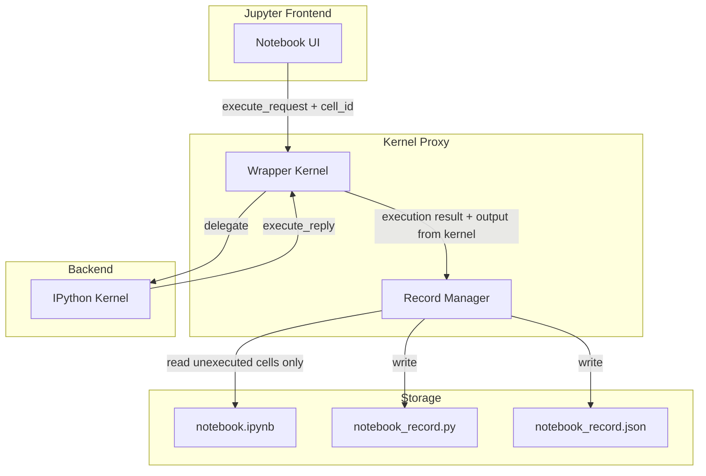

# Jupyter Kernel 代理插件 MVP 实现计划

## 目标

将 ipynb 的执行操作转换为 agent 更易理解、修改和交互的格式。代理拦截 kernel 的启动、执行和输出，生成包含以下内容的记录：

- **成功执行的 cell**：原始代码
- **执行报错的 cell**：代码外层包裹 `try: except Exception as e: print(e)`
- **未执行的 cell**：以 `# %% + cell_id` 标记

**编辑规则**：仅允许修改/新增未执行的 cell；已执行或报错的 cell 不可修改。

---

## 架构概览




---

## 技术方案

### 1. 核心组件：Wrapper Kernel

- **继承**：`ipykernel.ipkernel.IPythonKernel`（保留完整 Python 能力）
- **重写**：`do_execute(code, silent, store_history, user_expressions, allow_stdin, cell_id=None)`
  - ipykernel 6.11+ 支持通过 `cell_id` 参数接收 cell ID（来自 `execute_request` 的 metadata）
- **流程**：
  1. 调用 `super().do_execute(...)` 执行代码
  2. 拦截本次执行的 IOPub 消息（stream、error、execute_result），获取 stdout/stderr/traceback
  3. 根据 `execute_reply` 的 `status`（`ok` / `error`）决定记录方式
  4. 成功：记录原始 `code`，输出来自 kernel
  5. 报错：记录 `try/except` 包装的代码，并以**注释形式**写入 `ename`、`evalue`、`traceback`
  6. 将 `{cell_id, status, code, error_info?, output}` 追加到 execution_log，调用 Record Manager 更新记录

### 2. Notebook 路径获取

Kernel 需要知道当前 notebook 的路径以读取 ipynb 并写入 record。采用多级回退：


| 优先级 | 来源                                             | 说明                         |
| --- | ---------------------------------------------- | -------------------------- |
| 1   | Magic `%notebook_path /path/to/notebook.ipynb` | 用户显式设置，最可靠                 |
| 2   | 环境变量 `JUPYTER_NOTEBOOK_PATH`                   | 可由 Server 扩展或启动脚本设置        |
| 3   | `JPY_SESSION_NAME`                             | 部分 Jupyter 环境会传入（可能为 UUID） |


若均不可用，仅记录已执行 cell，不合并未执行 cell。

### 3. Record Manager

职责：维护记录、合并 ipynb、写入 .py 和 JSON。**执行状态与输出均从 kernel 读取**，不从 ipynb 读取（避免 ipynb 未保存导致的同步问题）。

**输入**：

- 从 **Kernel** 接收：已执行 cell 的 `{cell_id, code, status, error_info?, output}`（含 stdout/stderr/traceback，来自 kernel 的 IOPub 消息）
- 从 **ipynb** 读取：仅用于获取未执行 cell 的代码列表（cell 不在 kernel 的 execution_log 中即视为未执行）

**逻辑**：

1. Kernel 在内存中维护 `execution_log`：按执行顺序记录 `{cell_id, status, ...}`，每次 `do_execute` 完成后追加
2. 解析 ipynb 获取所有 code cell 及其顺序
3. 按 cell 顺序构建列表：
  - 若 `cell_id` 在 execution_log 中 → 已执行，从 kernel 结果取 code/status/output，`editable: false`
  - 否则 → 未执行，从 ipynb 取 code，`editable: true`
4. **判断是否执行的依据**：完全由 kernel 的 execution_log 决定，不依赖 ipynb 的 `execution_count` 或 `outputs`

**输出**：

- `{notebook_stem}_record.py`：供 agent 阅读的 Python 文件
- `{notebook_stem}_record.json`：结构化数据，含 `execution_log`（Execution Timeline）

### 4. Record 文件格式

`**.py` 格式示例**：

```python
# %% cell_abc123
# [executed - do not modify]
x = 1
print(x)

# %% cell_def456
# [error - do not modify]
# NameError: name 'undefined_var' is not defined
# Traceback (most recent call last):
#   File "<cell>", line 2, in <module>
#     y = undefined_var
# NameError: name 'undefined_var' is not defined
try:
    y = undefined_var
except Exception as e:
    print(e)

# %% cell_xyz789
# [pending - editable]
some_unexecuted_code()
```

`**.json` 格式示例**：

```json
{
  "notebook_path": "/path/to/notebook.ipynb",
  "execution_log": [
    { "cell_id": "cell_abc123", "status": "ok" },
    { "cell_id": "cell_def456", "status": "error" }
  ],
  "cells": [
    {"id": "cell_abc123", "code": "x = 1\nprint(x)", "status": "ok", "editable": false},
    {"id": "cell_def456", "code": "try:\n    ...\nexcept...", "status": "error", "editable": false, "error_info": {"ename": "NameError", "evalue": "name 'undefined_var' is not defined", "traceback": ["..."]}},
    {"id": "cell_xyz789", "code": "some_unexecuted_code()", "status": "pending", "editable": true}
  ]
}
```

**Execution Timeline**：`execution_log` 按实际执行顺序记录已执行的 cell，便于 agent 理解执行先后（可能与 notebook 中的 cell 顺序不同，如先执行 a、c，再执行 b）。

### 5. 编辑约束与 Agent 交互

- **约定**：agent 只修改 `editable: true` 的 cell
- **实现**：在 record 中通过注释和 `editable` 字段明确标注
- **可选**：提供 `jupylink apply-edits` CLI，从修改后的 record 写回 ipynb 的未执行 cell（仅更新 `editable` 部分）

---

## 项目结构

```
jupylink/
├── pyproject.toml
├── src/
│   └── jupylink/
│       ├── __init__.py
│       ├── kernel.py          # Wrapper Kernel
│       ├── record_manager.py  # Record 读写与合并
│       └── magics.py          # %notebook_path magic
├── kernels/
│   └── jupylink/
│       └── kernel.json        # Kernel spec
└── README.md
```

---

## 依赖

- `ipykernel` >= 6.11（支持 cell_id）
- `nbformat`（解析 ipynb）
- `jupyter_client`（kernel 基础设施）

---

## 安装与使用

1. **安装**：`pip install -e .`
2. **注册 kernel**：`jupyter kernelspec install kernels/jupylink`
3. **在 Notebook 中**：选择 "JupyLink" kernel，可选首 cell 运行 `%notebook_path ./my_notebook.ipynb`
4. **执行 cell**：每次执行后自动更新 `my_notebook_record.py` 和 `my_notebook_record.json`

---

## MVP 范围与后续扩展

**MVP 包含**：

- Wrapper kernel 拦截执行
- 成功/报错 cell 记录（含 try/except 包装）
- 从 ipynb 合并未执行 cell
- 双格式输出（.py + .json）
- `%notebook_path` magic

**后续可扩展**：

- Jupyter Server 扩展自动注入 notebook 路径
- `jupylink apply-edits` 将 record 的修改写回 ipynb
- 对 record 修改的校验（拒绝修改 non-editable cell）

